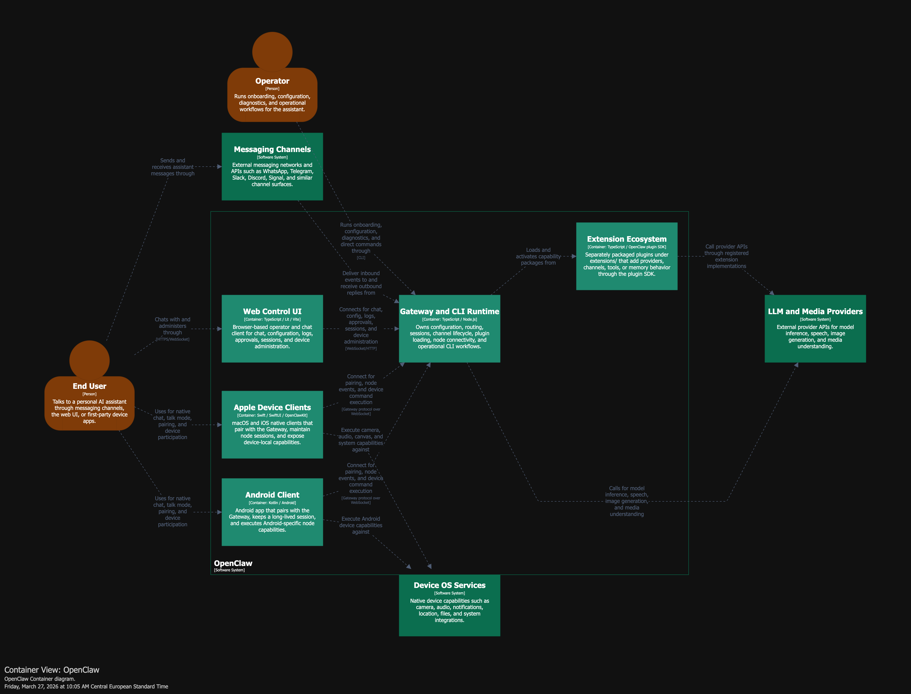

# Structurizr skill

Disclaimer: Based on fedemagnani skill.

This skills walks trhough your codebase and generates beatufiful diagrams via the [C4 model](https://c4model.com/).

Unlike Mermaid, structurizr provides a harness to create simple yet expressive diagrams without clutter or complex node interactions. Diagrams can be expanded as needed, allowing the viewer to focus on specific containers or components with full control.

I find it particularly useful when I need to:
- Reading the codebase for the first time
- Mitigate cognitive debt after several agentic contributions

## Installation

You can install the skill via
```
npx skills add fedemagnani/structurizr-skill
```

The skill validates the structurizr diagram via the cli tool. You can install it via 

```
brew install structurizr-cli
```
